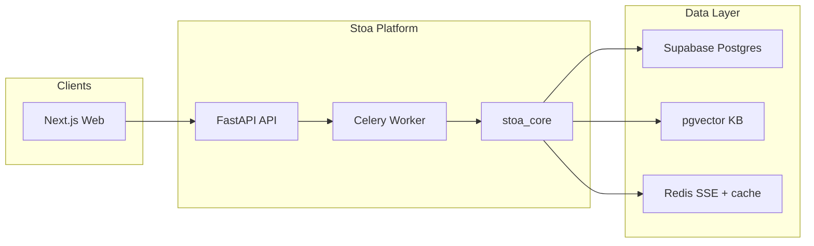

# Stoa — Marketing Intelligence Platform

**Stoa** helps marketing and GTM teams turn scattered customer data into actionable intelligence. Connect CRMs, call transcripts, support tickets, and reviews—or upload documents—and the platform **precomputes** ICP profiles, pain points, objections, and campaign-ready insights. When you ask a question, Stoa retrieves stored evidence and synthesizes one cited answer instead of running expensive research from scratch.

Built for B2B marketing teams, revenue operators, and founders who need a single place to understand their customers, monitor competitors, and generate campaigns grounded in real data.

[](https://www.python.org/)
[](https://nextjs.org/)
[](https://fastapi.tiangolo.com/)
[](https://supabase.com/)

---

## Table of contents

- [Features](#features)
- [Getting started](#getting-started)
- [Usage](#usage)
- [Architecture](#architecture)
- [Tech stack](#tech-stack)
- [Repository layout](#repository-layout)
- [Contributing](#contributing)
- [Credits & acknowledgments](#credits--acknowledgments)
- [License](#license)
- [Further reading](#further-reading)

---

## Features

| Area | What it does |
|------|----------------|
| **Customer Intelligence** | Ingest documents and CRM data → extract signals → build ICP profiles → precomputed insights + cited Q&A |
| **Data Hub** | Company profile, native integrations (HubSpot, Gong, CSV, reviews, …), file upload, competitors, brand voice |
| **Competitive Intelligence** | Track competitor URLs, detect changes, surface alerts |
| **Campaigns** | Brief → multi-asset campaign package with brand voice and retrieved context |
| **Unified knowledge base** | Hybrid RAG (pgvector + full-text + rerank) shared across all features |

---

## Getting started

### Prerequisites

| Requirement | Version / notes |
|-------------|-----------------|
| **Node.js** | 20+ |
| **pnpm** | 9+ (repo pins `pnpm@11.5.3` via `packageManager`) |
| **Python** | 3.11+ |
| **Docker** | For local Redis (`docker compose`) |
| **Supabase CLI** | Optional but recommended for migrations (`supabase db push`) |
| **Supabase project** | Postgres + Auth + Storage (hosted or local stack) |

You also need LLM provider credentials for ingestion and synthesis (Vertex AI recommended; OpenAI/Anthropic supported via failover). See [`services/api/.env.example`](services/api/.env.example).

### Installation

**1. Clone the repository**

```bash
git clone https://github.com/Aniket25042003/Stoa.git
cd Stoa
```

**2. Start Redis**

```bash
docker compose up -d redis
```

Default local URL: `redis://:localdev@localhost:6379/0` (matches `docker-compose.yml`).

**3. Apply database migrations**

```bash
supabase link --project-ref <your-project-ref>   # first time only
supabase db push
```

Alternatively, run SQL from [`supabase/migrations/`](supabase/migrations/) in the Supabase SQL editor.

**4. Configure the web app**

```bash
cp apps/web/.env.example apps/web/.env.local
pnpm install
```

Set at minimum:

- `NEXT_PUBLIC_SUPABASE_URL`
- `NEXT_PUBLIC_SUPABASE_ANON_KEY`
- `NEXT_PUBLIC_API_URL` (e.g. `http://localhost:8000`)

**5. Configure and run the API + worker**

```bash
cd services/api
python -m venv .venv && source .venv/bin/activate   # Windows: .venv\Scripts\activate
pip install -r requirements.txt
cp .env.example .env
# Edit .env with Supabase keys, Redis URL, and LLM settings
uvicorn app.main:app --reload --port 8000
```

In a **second terminal** (same venv):

```bash
cd services/api
source .venv/bin/activate
celery -A app.celery_app worker -l info
```

On macOS, if the worker misbehaves with prefork:

```bash
celery -A app.celery_app worker -l info --pool=solo --concurrency=1
```

**6. Run the web app**

From the repo root:

```bash
pnpm dev:web
```

Open [http://localhost:3000](http://localhost:3000), sign in (Google OAuth or email), complete onboarding, then use **Data hub** to connect sources or upload content.

---

## Usage

### Health check

```bash
curl http://localhost:8000/health
# {"status":"ok"}
```

### Typical local workflow

1. **Sign up / sign in** → onboarding creates your organization and company profile.
2. **Data hub** (`/data`) → connect HubSpot or import a structured CSV; paste or upload call transcripts and reviews.
3. **Intelligence** (`/intelligence`) → view precomputed ICP insights, signals, and ask follow-up questions with citations.
4. **Competitive** → add competitor URLs for monitoring.
5. **Campaigns** → submit a brief to generate assets.

### Integration environment (optional)

For OAuth connectors (HubSpot, Gong, etc.):

```bash
# services/api/.env
INTEGRATION_CREDENTIALS_KEY=   # Fernet key — required in production
API_BASE_URL=http://localhost:8000
HUBSPOT_CLIENT_ID=
HUBSPOT_CLIENT_SECRET=
APIFY_API_TOKEN=               # G2/Capterra reviews import
```

Generate a Fernet key:

```bash
python -c "from cryptography.fernet import Fernet; print(Fernet.generate_key().decode())"
```

### Run tests

```bash
# Core library
cd services/core && PYTHONPATH=src python -m pytest -q

# API
cd services/api && PYTHONPATH=../core/src:app python -m pytest -q
```

---

## Architecture

High-level data flow: inputs are ingested into a unified knowledge base; queries retrieve context once, then a single LLM synthesis call produces the answer.



**Integration path:** OAuth/API connect → canonical CRM tables + knowledge base → signal extraction → ICP rebuild → precomputed insights.

Detailed docs: [`docs/architecture.md`](docs/architecture.md) · [`AGENTS.md`](AGENTS.md)

---

## Tech stack

| Layer | Technologies |
|-------|----------------|
| **Frontend** | Next.js 15, React 19, Tailwind CSS v4, Supabase Auth (`@supabase/ssr`) |
| **API** | FastAPI, Pydantic, JWT verification, Server-Sent Events |
| **Workers** | Celery, Redis |
| **Core library** | `stoa_core` — ingestion, hybrid RAG, LLM routing, integrations |
| **Database** | Supabase (Postgres), Row Level Security, pgvector (`halfvec` 3072) |
| **AI / ML** | Vertex AI / OpenAI / Anthropic (routed), Cohere rerank, Gemini embeddings |
| **Integrations** | HubSpot, Gong, Zendesk, Intercom, Salesforce, CSV, Apify (reviews), Slack, Notion, and more |
| **Deploy targets** | Vercel (web), Render/Railway (API + worker), Supabase (data + auth) |

---

## Repository layout

```
├── apps/web/                 # Next.js application (Vercel)
├── services/
│   ├── api/                  # FastAPI routes, Celery tasks
│   └── core/                 # stoa_core shared Python package
├── supabase/migrations/      # Postgres schema + RLS
├── docs/                     # Architecture, security, runbooks, ADRs
├── legacy/                   # Archived code (reference only — do not deploy)
├── AGENTS.md                 # Agent / contributor architecture guide
└── docker-compose.yml        # Local Redis
```

---

## Contributing

Contributions are welcome. Before opening a pull request:

1. **Search existing issues** to avoid duplicate work.
2. **Follow the monorepo conventions** in [`AGENTS.md`](AGENTS.md) — phases, RLS, no secrets in the client bundle, tests for new behavior.
3. **Keep commits focused** — one logical change per commit (schema, API, UI, etc.) so features can be reverted independently.
4. **Run linters and tests** before submitting:
   - `ruff` + `pytest` in `services/core` and `services/api`
   - `pnpm lint:web` for the frontend
5. **Do not commit secrets** — use `.env.example` files as templates only.

For large features, check [`docs/agents/`](docs/agents/) for phase docs and Definition of Done gates.

> A dedicated `CONTRIBUTING.md` may be added later; until then, this section and `AGENTS.md` are the source of truth.

---

## Credits & acknowledgments

- **Architecture patterns** — precompute-over-regenerate, hybrid RAG, and multi-org IAM documented in [`docs/decisions/`](docs/decisions/).
- **Open-source foundations** — [Next.js](https://nextjs.org/), [FastAPI](https://fastapi.tiangolo.com/), [Celery](https://docs.celeryq.dev/), [Supabase](https://supabase.com/), [pgvector](https://github.com/pgvector/pgvector).
- **Integration providers** — [HubSpot API](https://developers.hubspot.com/), [Gong API](https://help.gong.io/docs/what-the-gong-api-provides), [Apify](https://apify.com/) (review ingestion), and other SaaS APIs documented in [`docs/agents/phase-1d-customer-data-integrations.md`](docs/agents/phase-1d-customer-data-integrations.md).
- **Deployment references** — [`docs/runbook.md`](docs/runbook.md) for Vercel, Render/Railway, and Supabase setup.

---

## License

This repository is currently **private** and does not include a root `LICENSE` file. All rights reserved by the repository owner unless a license is explicitly added.

If you plan to open-source Stoa, add a `LICENSE` file (e.g. MIT or Apache-2.0) at the repo root and update this section with a link to it.

---

## Further reading

| Document | Description |
|----------|-------------|
| [`AGENTS.md`](AGENTS.md) | Master architecture and agent build instructions |
| [`docs/runbook.md`](docs/runbook.md) | Production deployment and env vars |
| [`docs/security.md`](docs/security.md) | Auth, RLS, and secret handling |
| [`docs/agents/phase-1-customer-intelligence.md`](docs/agents/phase-1-customer-intelligence.md) | Customer Intelligence feature |
| [`docs/agents/phase-1d-customer-data-integrations.md`](docs/agents/phase-1d-customer-data-integrations.md) | CRM & integration connectors |
