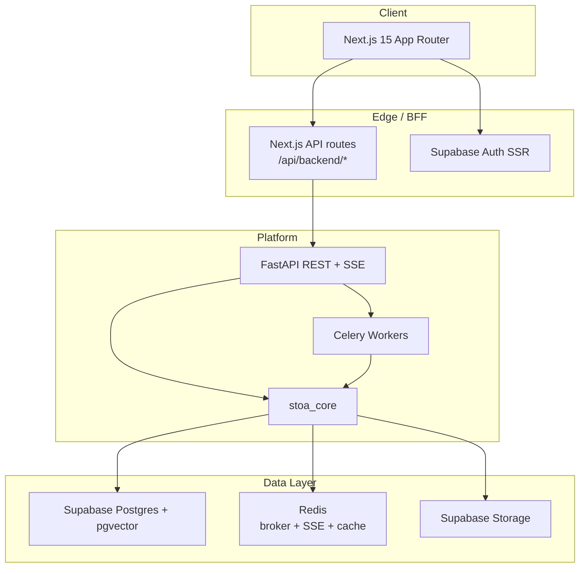

# Stoa

Marketing intelligence platform for B2B GTM teams — built around the highest-frequency pain points in marketing and sales, not another generic AI copywriter.

Stoa connects CRMs, call transcripts, support tickets, reviews, and competitor data, then **precomputes** living intelligence in the background: ICP profiles, pain points, competitive alerts, and campaign assets. When you ask a question, the system retrieves stored evidence from a unified knowledge base and synthesizes one cited answer, instead of running expensive research from scratch on every request.

---

## Problem Statement

Marketing and GTM teams repeat the same research and coordination work across disconnected tools. The questions come up constantly; the current process takes days.


| #   | Pain point                        | What teams struggle with today                                                                                                                                                                                         |
| --- | --------------------------------- | ---------------------------------------------------------------------------------------------------------------------------------------------------------------------------------------------------------------------- |
| 1   | **ICP & customer research**       | Who are our best customers? What pain points and objections show up in calls? What messaging resonates? What are competitors saying? Teams manually read Gong transcripts, CRM exports, reviews, and competitor sites. |
| 2   | **Content creation bottleneck**   | One campaign needs a blog, LinkedIn/X posts, email sequence, landing page, ad copy, and sales enablement — each drafted, reviewed, rewritten, and approved separately.                                                 |
| 3   | **Competitive intelligence**      | Feature launches, pricing changes, new campaigns, and market moves are tracked by manually visiting sites, reading newsletters, and watching social feeds.                                                             |
| 4   | **Campaign analysis**             | Leaders need to know why campaign A beat campaign B, which channel drives pipeline, which audience converts, and which message works — not another copy generator.                                                     |
| 5   | **Sales–marketing alignment**     | Sales says leads are bad; marketing says sales isn't following up. Nobody has a shared, evidence-backed view of which leads convert, which campaigns generate revenue, or where deals stall.                           |
| 6   | **Campaign launch orchestration** | A feature release means updating the website, landing page, emails, social, ads, CRM, sales notifications, and content calendar — coordinated across people and tools.                                                 |


Stoa is designed as a single platform that addresses all six. **Three pillars are implemented today**; the other three are on the roadmap.

---

## Solution

Stoa's core bet: **precompute intelligence continuously, answer with retrieval** — not regenerate from scratch on every question.

Instead of producing a static GTM document, Stoa ingests customer and market data once, keeps ICP profiles and insights up to date, and grounds every answer and asset in stored evidence.

1. **Ingest once** — uploads, pastes, and integration syncs (Gong, HubSpot, Salesforce, G2 reviews, Reddit, competitor sites) flow through background Celery jobs.
2. **Store intelligence** — signals, versioned ICP profiles, competitive snapshots, precomputed insights, and campaign assets land in Postgres; semantic chunks live in pgvector.
3. **Answer with retrieval** — questions and briefs retrieve hybrid context (vector + full-text, reranked and budget-trimmed), then a single LLM synthesis call produces a cited response or asset package.
4. **Stream progress** — long-running jobs publish events over Redis streams; the web app consumes them via Server-Sent Events.

The goal is not "generate a blog." It is **turn one product update into a full campaign package**, grounded in who your customers actually are and what competitors are doing.

---

## Product Pillars

### Shipped (in active development)


| Pillar                          | Maps to pain point                              | What Stoa does today                                                                                                                                                                                                  |
| ------------------------------- | ----------------------------------------------- | --------------------------------------------------------------------------------------------------------------------------------------------------------------------------------------------------------------------- |
| **ICP & Customer Intelligence** | #1 ICP & customer research                      | Ingest Gong transcripts, CRM data (HubSpot/Salesforce), G2/Capterra reviews, Reddit, and uploaded docs → extract signals → build **continuously updated** versioned ICP profiles → precomputed insights and cited Q&A |
| **Competitive Intelligence**    | #3 Competitive intelligence                     | Track competitor URLs, scan snapshots, detect changes (pricing, features, messaging), and surface alerts                                                                                                              |
| **Campaign Orchestration**      | #2 Content bottleneck + #6 Launch orchestration | Submit a brief grounded on ICP + competitive context → generate multi-asset campaign packages (messaging, landing copy, emails, social, battlecard) asynchronously                                                    |


### Planned


| Pillar                        | Maps to pain point             | Direction                                                                                                                             |
| ----------------------------- | ------------------------------ | ------------------------------------------------------------------------------------------------------------------------------------- |
| **Content at scale**          | #2 Content creation bottleneck | Expand asset types and workflows so one input (e.g. product update) fans out into 20+ coordinated assets with review/approval gates   |
| **Campaign Analysis**         | #4 Campaign analysis           | Connect GA4, PostHog, and CRM pipeline data to answer why campaigns win, which channels convert, and which messages work              |
| **Sales–Marketing Alignment** | #5 Sales–marketing alignment   | Analyze CRM, email engagement, and call transcripts to show which leads convert, which campaigns drive revenue, and where deals stall |


---

## Key Features (platform)


| Area                       | What it does                                                                                                                                                   |
| -------------------------- | -------------------------------------------------------------------------------------------------------------------------------------------------------------- |
| **Data Hub**               | Central workspace for company profile, file upload, structured CSV import, native integrations, competitors, and brand voice                                   |
| **Unified Knowledge Base** | Hybrid RAG over `knowledge_chunks` — pgvector cosine search + Postgres full-text, fused with reciprocal rank fusion, reranked, and token-budgeted              |
| **Proactive Insights**     | Background precomputation of common intelligence questions after ingestion and ICP rebuild                                                                     |
| **Multi-org IAM**          | Users can belong to multiple organizations; RBAC with system roles (`owner`, `admin`, `analyst`, `viewer`) plus custom roles                                   |
| **Integrations**           | Native connectors for HubSpot, Gong, Salesforce, Zendesk, Intercom, Slack, Notion, Google Drive, GA4, PostHog, Reddit, reviews (via Apify), and structured CSV |


---

## Tech Stack

### Frontend

- **Next.js 15** (App Router, Turbopack in dev)
- **React 19**
- **Tailwind CSS v4**
- **Supabase Auth** (`@supabase/ssr`, `@supabase/supabase-js`)
- **Framer Motion**, **Three.js** / React Three Fiber (marketing immersive pages)
- **TypeScript**

### Backend

- **FastAPI**: REST API, JWT verification, SSE endpoints
- **Celery**: background ingestion, ICP build, competitive scans, campaign generation, integration syncs
- **stoa_core**: shared Python package (ingestion, RAG, LLM routing, integrations, security)
- **Pydantic** / **pydantic-settings**
- **Python 3.11+** (CI runs on 3.12)

### Database

- **Supabase Postgres**: primary data store with Row Level Security
- **pgvector**: `halfvec(3072)` embeddings in `knowledge_chunks`
- **Supabase Auth**: Google OAuth, Microsoft Azure OAuth, email/password
- **Supabase Storage**: document uploads

### Mobile

- No native mobile app. The web UI is responsive with a dedicated mobile navigation shell (`AppMobileNav`).

### APIs / Services

- **Redis**: Celery broker, SSE streams, rate limiting, KB cache
- **Vertex AI** / **OpenAI** / **Anthropic**: LLM routing with optional auto-failover
- **Gemini embeddings** (`gemini-embedding-001`, 3072 dimensions)
- **Cohere**:  reranking
- **Apify**: G2/Capterra review ingestion
- **14 integration connectors**: HubSpot, Gong, Salesforce, Zendesk, Intercom, Slack, Notion, Google Drive, Jira, GA4, PostHog, Reddit, structured CSV, reviews

### Testing / DevTools

- **pytest**: `services/core` (~~56 tests) and `services/api` (~~33 tests)
- **ruff**: Python linting
- **ESLint**: Next.js frontend (`pnpm lint:web`)
- **gitleaks**: secret scanning in CI
- **pip-audit** / **pnpm audit**: dependency auditing
- **Supabase CLI**: local migrations (`supabase db push`)
- **Docker Compose**: local Redis

### Deployment / Infrastructure

- **Vercel**: web frontend (`apps/web`)
- **Render**: FastAPI + Celery worker
- **Supabase**: hosted Postgres, Auth, Storage
- **GitHub Actions**: CI on push/PR to `main`/`master`

---

## Architecture Overview




### Request flow (Q&A example)

1. User submits a question in the Intelligence workspace.
2. Next.js BFF proxy forwards the request to FastAPI with the Supabase JWT and active org header (`X-Org-Id`).
3. FastAPI enqueues a Celery task and returns a conversation ID.
4. The worker calls `stoa_core` to retrieve hybrid context from `knowledge_chunks`, rerank, and synthesize one answer.
5. Progress and the final message stream back through Redis → SSE → browser.

### Memory layers


| Layer      | Store                    | Purpose                                                                          |
| ---------- | ------------------------ | -------------------------------------------------------------------------------- |
| Short-term | Redis streams + KB cache | SSE job progress, query-embedding cache, retrieval cache                         |
| Long-term  | Postgres                 | Orgs, documents, intelligence signals, ICP, campaigns, conversations             |
| Semantic   | pgvector `halfvec(3072)` | Unified `knowledge_chunks` across all features                                   |
| Structured | Postgres tables          | `intelligence`, `icp_profiles`, `precomputed_insights`, `canonical_*` CRM tables |


### Design principles

- **Precompute, don't regenerate**: expensive LLM chains run in background jobs; the query path is retrieve + synthesize once.
- **Supabase-first**: one Postgres for structured and vector data; RLS for tenant isolation.
- **Thin API, fat core**: HTTP handlers stay small; business logic lives in `stoa_core` for testability.
- **BFF proxy**: the browser never receives `SUPABASE_SERVICE_ROLE_KEY` or direct service credentials.

Detailed architecture docs: `[docs/architecture.md](docs/architecture.md)` · `[docs/architecture-ops.md](docs/architecture-ops.md)` · `[AGENTS.md](AGENTS.md)`

---

## Project Structure

```
├── apps/web/                    # Next.js application (marketing + authenticated product)
│   └── src/
│       ├── app/(marketing)/       # Public pages: /, /pricing, /faq, /waitlist, …
│       ├── app/(app)/           # Product: /dashboard, /data, /intelligence, …
│       ├── app/(onboarding)/    # Onboarding wizard
│       ├── app/api/             # BFF routes (backend proxy, auth, waitlist)
│       ├── components/          # app-shell, product design system, marketing UI
│       └── lib/                 # api helpers, auth, navigation, SSE, theme
├── services/
│   ├── api/                     # FastAPI routes, Celery task definitions, deps
│   ├── core/                    # stoa_core shared Python package
│   └── worker/                  # Thin requirements pin for separate worker deploy
├── supabase/migrations/         # Postgres schema, RLS policies, pgvector RPCs
├── docs/                        # Architecture, security, runbooks, phase docs
│   ├── backend/                 # API routes, Celery, ingestion, RAG, integrations
│   ├── frontend/                # Component tree, data flow, state management
│   ├── agents/                  # Per-phase build docs and exit criteria
│   ├── DATABASE.md              # Schema and pgvector reference
│   ├── FRONTEND.md              # App Router and BFF patterns
│   └── TESTING.md               # Test organization and CI
├── legacy/                      # Archived GTM code (reference only — do not deploy)
├── AGENTS.md                    # Agent and contributor architecture guide
└── docker-compose.yml           # Local Redis
```

The repo is organized as a **pnpm monorepo** for the frontend with Python services alongside. Modular docs under `docs/backend/`, `docs/frontend/`, and `docs/DATABASE.md` expand on each layer.

---

## Setup and Installation

### Prerequisites


| Requirement          | Version / notes                                                |
| -------------------- | -------------------------------------------------------------- |
| **Node.js**          | 20+ (CI uses 22)                                               |
| **pnpm**             | 9+ (repo pins `pnpm@11.5.3`)                                   |
| **Python**           | 3.11+                                                          |
| **Docker**           | For local Redis                                                |
| **Supabase project** | Postgres + Auth + Storage (hosted or local)                    |
| **Supabase CLI**     | Recommended for migrations                                     |
| **LLM credentials**  | Vertex AI recommended; OpenAI/Anthropic supported via failover |


### 1. Clone the repository

```bash
git clone https://github.com/Aniket25042003/Stoa.git
cd Stoa
```

### 2. Start Redis

```bash
docker compose up -d redis
```

Default local URL: `redis://:localdev@localhost:6379/0`

### 3. Apply database migrations

```bash
supabase link --project-ref <your-project-ref>   # first time only
supabase db push
```

Alternatively, run SQL from `[supabase/migrations/](supabase/migrations/)` in the Supabase SQL editor.

Configure Supabase Auth (Google OAuth redirect URLs, site URL) per `[docs/security.md](docs/security.md)`.

### 4. Configure the web app

```bash
cp apps/web/.env.example apps/web/.env.local
pnpm install
```

Minimum variables in `apps/web/.env.local`:


| Variable                        | Purpose                                    |
| ------------------------------- | ------------------------------------------ |
| `NEXT_PUBLIC_SUPABASE_URL`      | Supabase project URL                       |
| `NEXT_PUBLIC_SUPABASE_ANON_KEY` | Public anon key                            |
| `NEXT_PUBLIC_API_URL`           | FastAPI URL (e.g. `http://localhost:8000`) |


See `[apps/web/.env.example](apps/web/.env.example)` for prelaunch gating (`NEXT_PUBLIC_APP_ENABLED`) and server-side `API_URL`.

### 5. Configure the API and worker

```bash
cd services/api
python -m venv .venv && source .venv/bin/activate
pip install -r requirements.txt
cp .env.example .env
```

Edit `services/api/.env` with at minimum:


| Category       | Variables                                                                               |
| -------------- | --------------------------------------------------------------------------------------- |
| Supabase       | `SUPABASE_URL`, `SUPABASE_SERVICE_ROLE_KEY`, `SUPABASE_ANON_KEY`, `SUPABASE_JWT_SECRET` |
| Redis/Celery   | `REDIS_URL`, `CELERY_BROKER_URL`, `CELERY_RESULT_BACKEND`                               |
| LLM            | `STOA_LLM_PROVIDER`, Vertex or OpenAI/Anthropic keys (see `.env.example`)               |
| Embeddings/RAG | `EMBED_MODEL`, `EMBED_DIMENSIONS`, optional `COHERE_API_KEY`                            |


Full template: `[services/api/.env.example](services/api/.env.example)`

For OAuth integrations (HubSpot, Gong, etc.), also set `INTEGRATION_CREDENTIALS_KEY` (Fernet key) and provider client credentials:

```bash
python -c "from cryptography.fernet import Fernet; print(Fernet.generate_key().decode())"
```

---

## Running the Project

Run each service in a separate terminal.

### API (port 8000)

From repo root:

```bash
pnpm dev:api
```

Or manually:

```bash
cd services/api
source .venv/bin/activate
uvicorn app.main:app --reload --port 8000
```

### Celery worker

From repo root:

```bash
pnpm dev:worker
```

Or manually from `services/api` with the API venv active:

```bash
celery -A app.celery_app worker -l info
```

> Running Celery from the monorepo root fails with `No module named 'app'`. Always use the venv under `services/api/`.

On macOS, if the prefork pool is unstable:

```bash
celery -A app.celery_app worker -l info --pool=solo --concurrency=1
```

### Web app (port 3000)

```bash
pnpm dev:web
```

Open [http://localhost:3000](http://localhost:3000).

### Health check

```bash
curl http://localhost:8000/health
# {"status":"ok"}
```

### Typical local workflow

1. Sign in (Google OAuth or email) → complete onboarding to create your organization.
2. **Data hub** (`/data`) — connect HubSpot, import CSV, or upload/paste customer content.
3. **Intelligence** (`/intelligence`) — view precomputed ICP insights and ask follow-up questions with citations.
4. **Competitive** (`/competitive`) — add competitor URLs for monitoring.
5. **Campaigns** (`/campaigns`) — submit a brief to generate assets.

---

## Testing

### Backend (pytest)

```bash
# Core library
cd services/core
pip install -e ".[dev]"
ruff check src tests
pytest -q

# API
cd services/api
pip install -r requirements-dev.txt
pytest -q
```

Optional integration tests (require live Supabase credentials):

```bash
RUN_INTEGRATION_TESTS=1 pytest -q tests/test_rls_integration.py
```

### Frontend

There are **no frontend unit or E2E tests** yet. CI runs lint and audit only:

```bash
pnpm lint:web
```

### CI pipeline

GitHub Actions (`[.github/workflows/ci.yml](.github/workflows/ci.yml)`) runs on push/PR:


| Job       | Checks                                    |
| --------- | ----------------------------------------- |
| `web`     | `pnpm lint:web`, `pnpm audit`             |
| `core`    | `ruff`, `pytest` (~56 tests), `pip-audit` |
| `api`     | `pytest` (~33 tests), `pip-audit`         |
| `secrets` | gitleaks scan                             |


See `[docs/TESTING.md](docs/TESTING.md)` for coverage gaps and file-level test map.

---

## Future Improvements / Roadmap

### Next product pillars (pain points #2, #4, #5)

- **Campaign analysis** — connect ad/attribution and CRM pipeline data (GA4, PostHog connectors exist) to explain performance, channel mix, and message effectiveness
- **Sales–marketing alignment** — unified view of lead quality, campaign-sourced revenue, and deal stall points from CRM + engagement + call data
- **Content at scale** — broader asset fan-out from a single brief with critic/revise approval workflows

### Hardening shipped pillars (#1, #3, #6)

- **ICP Intelligence** — deeper Gong/CRM signal extraction, richer precomputed insight sets, stronger continuous profile updates
- **Competitive** — Celery Beat for scheduled scans; robots.txt parsing; broader change categorization (pricing, features, campaigns)
- **Campaigns** — LangGraph generate → critic → revise loops with human gates; brand voice profiles per org; PDF/Markdown export; tighter launch orchestration across asset types

### Platform & launch

- **Public launch** — production currently waitlist-only; set `NEXT_PUBLIC_APP_ENABLED=true` when ready for open sign-in
- **Testing** — Playwright E2E for onboarding, ask-question, and campaign flows; frontend unit tests
- **Observability** — optional LangSmith tracing for worker tasks (`LANGSMITH_TRACING`)

Phase documentation with exit criteria: `[docs/agents/](docs/agents/)`

---

## Key Implementation Notes

- **Multi-org tenancy** — Active org resolves from `X-Org-Id` header → `user_profiles.last_active_org_id` → sole membership. Ambiguous multi-org requests return `409 org_selection_required`. Orgs are created via onboarding, not auto-provisioned on signup.
- **RBAC** — Four immutable system roles plus custom roles with `resource:action` permissions. The API enforces permissions on writes and expensive job triggers; RLS provides coarse table access.
- **Hybrid retrieval** — `match_knowledge` RPC fuses pgvector cosine distance and Postgres `ts_rank` via reciprocal rank fusion. Results pass through Cohere (optional) → Vertex batch LLM → BM25 reranking, MMR dedup, and token-budget trimming.
- **Idempotent ingestion** — Knowledge writes are idempotent on `uri` + `content_hash`; Redis `kb_version` bumps on every write.
- **Security defaults** — Production requires `INTERNAL_PROXY_SECRET`, `INVITE_TOKEN_PEPPER`, and `INTEGRATION_CREDENTIALS_KEY`. Redis TLS enforced in production. PII redaction on stored content and logs.
- **Legacy code** — `legacy/` contains archived GTM agent code. Do not import or deploy it; copy patterns only.
- **Agent orchestration** — Phases 0–2 use plain typed Python + Celery. LangGraph is reserved for Phase 3+ resumable critic/revise workflows when needed.

Further reading: `[docs/security.md](docs/security.md)` · `[docs/reliability.md](docs/reliability.md)` · `[docs/runbook.md](docs/runbook.md)`

---

## Contributing

Contributions are welcome. Before opening a pull request:

1. Search existing issues to avoid duplicate work.
2. Follow monorepo conventions in `[AGENTS.md](AGENTS.md)` — RLS for new tables, no secrets in the client bundle, tests for new behavior.
3. Keep commits focused — one logical change per commit when possible.
4. Run linters and tests locally:
  - `ruff` + `pytest` in `services/core` and `services/api`
  - `pnpm lint:web` for the frontend
5. Do not commit secrets — use `.env.example` files as templates only.

For large features, check `[docs/agents/](docs/agents/)` for phase docs and Definition of Done gates.

A dedicated `CONTRIBUTING.md` may be added later; until then, this section and `AGENTS.md` are the source of truth.

---

## License

This repository is currently **private** and does not include a root `LICENSE` file. All rights reserved by the repository owner unless a license is explicitly added.

---

## Further Reading


| Document                                                               | Description                                      |
| ---------------------------------------------------------------------- | ------------------------------------------------ |
| `[AGENTS.md](AGENTS.md)`                                               | Master architecture and agent build instructions |
| `[docs/architecture.md](docs/architecture.md)`                         | System architecture and data flows               |
| `[docs/DATABASE.md](docs/DATABASE.md)`                                 | Schema, pgvector, RLS, hybrid retrieval RPC      |
| `[docs/FRONTEND.md](docs/FRONTEND.md)`                                 | App Router, BFF proxy, workspace patterns        |
| `[docs/TESTING.md](docs/TESTING.md)`                                   | Test organization, CI, coverage gaps             |
| `[docs/backend/BACKEND_OVERVIEW.md](docs/backend/BACKEND_OVERVIEW.md)` | FastAPI, Celery, stoa_core layout                |
| `[docs/backend/INTEGRATIONS.md](docs/backend/INTEGRATIONS.md)`         | Connector registry and sync pipeline             |
| `[docs/runbook.md](docs/runbook.md)`                                   | Production deployment and environment variables  |
| `[docs/security.md](docs/security.md)`                                 | Auth, RLS, secret handling, rate limits          |


