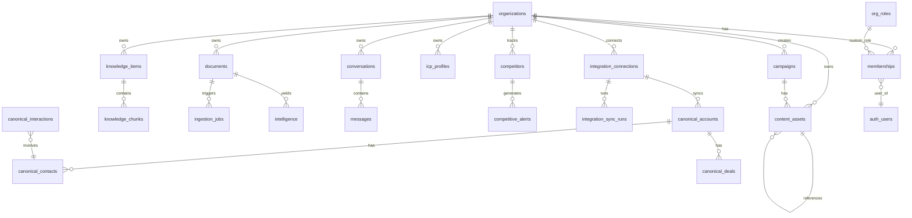

# Database

**One-liner:** Supabase Postgres with pgvector, RLS, and multi-org IAM schema.

## Why it exists

All tenant data — organizations, documents, knowledge chunks, conversations, integrations — lives in one Postgres database with Row Level Security. pgvector enables hybrid semantic + full-text retrieval without an external vector database.

## Entity-relationship overview

## Core tables

### Tenancy & IAM

| Table           | Purpose               | Key columns                                                      |
| --------------- | --------------------- | ---------------------------------------------------------------- |
| `organizations` | Tenant root           | `id`, `name`, `slug`, `website_url`, `industry`, `profile` jsonb |
| `memberships`   | User ↔ org link       | `org_id`, `user_id`, `role`, `custom_role_id`                    |
| `user_profiles` | User prefs            | `last_active_org_id`, onboarding state                           |
| `org_roles`     | Custom RBAC roles     | `permissions` jsonb (`resource:action` list)                     |
| `org_invites`   | Team invites          | `token_hash`, `email`, `role`, `expires_at`                      |
| `audit_log`     | Sensitive write trail | `action`, `resource_type`, `resource_id`, `metadata`             |

### Customer intelligence

| Table                  | Purpose                    | Key columns                                                   |
| ---------------------- | -------------------------- | ------------------------------------------------------------- |
| `data_sources`         | Upload/integration sources | `source_type`, `label`, `status`                              |
| `documents`            | Ingested files/text        | `title`, `doc_type`, `content`, `status`                      |
| `ingestion_jobs`       | Processing queue           | `document_id`, `status`, `error`                              |
| `intelligence`         | Extracted signals          | `kind` (pain_point, objection, etc.), `content`, `confidence` |
| `icp_profiles`         | Versioned ICP              | `version`, `profile` jsonb, `signal_count`                    |
| `precomputed_insights` | Cached Q&A                 | `scope`, `key`, `title`, `content` jsonb, `citations`         |
| `conversations`        | Q&A threads                | `title`, `created_by`                                         |
| `messages`             | Chat messages              | `conversation_id`, `role`, `content`                          |

### Knowledge base (Phase 1c)

| Table              | Purpose                 | Key columns                                                  |
| ------------------ | ----------------------- | ------------------------------------------------------------ |
| `knowledge_items`  | Logical knowledge units | `kind`, `title`, `content`, `uri`, `content_hash`, `version` |
| `knowledge_chunks` | Embedded chunks         | `embedding halfvec(3072)`, `content_tsv`, `token_count`      |

### Competitive & campaigns

| Table                | Purpose             | Key columns                                            |
| -------------------- | ------------------- | ------------------------------------------------------ |
| `competitors`        | Tracked URLs        | `name`, `website_url`, `last_snapshot`, `content_hash` |
| `competitive_alerts` | Change alerts       | `summary`, `severity`, `categories`                    |
| `campaigns`          | Generated campaigns | `brief`, `brand_voice`, `assets` jsonb, `status`       |
| `content_assets`     | Generated AI assets | `asset_type`, `prompt`, `files` jsonb, `status`        |
| `analytics_metric_facts` | GA4/PostHog metrics | `dimension_type`, `dimension_value`, `metrics` jsonb |
| `deal_stage_snapshots` | Deal stall tracking | `deal_id`, `stage`, `entered_at`                       |

### Integrations

| Table                     | Purpose         | Key columns                                   |
| ------------------------- | --------------- | --------------------------------------------- |
| `integration_connections` | OAuth/API creds | `provider`, `encrypted_credentials`, `status` |
| `integration_sync_runs`   | Sync history    | `status`, `records_written`, `error`          |
| `canonical_accounts`      | CRM accounts    | `external_id`, `name`, `industry`, `metadata` |
| `canonical_contacts`      | CRM contacts    | `email`, `title`, `account_id`                |
| `canonical_deals`         | CRM deals       | `stage`, `amount`, `close_date`               |
| `canonical_interactions`  | Calls/tickets   | `interaction_type`, `content`, `occurred_at`  |

## pgvector setup

| Column      | Type            | Index                       | Table                      |
| ----------- | --------------- | --------------------------- | -------------------------- |
| `embedding` | `halfvec(3072)` | HNSW (`halfvec_cosine_ops`) | `knowledge_chunks`         |
| `embedding` | `vector(768)`   | HNSW (`vector_cosine_ops`)  | `document_chunks` (legacy) |

Embedding model: `gemini-embedding-001` at 3072 dimensions (configurable via `EMBED_DIMENSIONS`).

## Full-text search

| Column        | Type                   | Index | Table              |
| ------------- | ---------------------- | ----- | ------------------ |
| `content_tsv` | `tsvector` (generated) | GIN   | `knowledge_chunks` |

Generated as: `to_tsvector('english', coalesce(content, ''))`.

## Hybrid retrieval RPC

`match_knowledge(p_org_id, p_query_embedding, p_query_text, p_kinds, p_match_count, p_rrf_k)` — defined in `[supabase/migrations/20260703000000_knowledge_base.sql](../supabase/migrations/20260703000000_knowledge_base.sql)`:

1. Vector hits ranked by cosine distance
2. Text hits ranked by `ts_rank`
3. Reciprocal Rank Fusion merges both ranked lists

## RLS

All public tables have RLS enabled. Policies use `current_org_id()` helper (later upgraded to multi-org via `has_org_permission()` in RBAC migration). API uses service role with application-level membership checks.

## Key indexes beyond vector

- `idx_knowledge_items_org_uri` — unique on `(org_id, uri)` where uri not null
- `idx_knowledge_items_org_kind` — kind filtering in retrieval
- `idx_memberships_user` — user → org lookup
- `idx_audit_log_org` — audit trail queries

## Tech decisions

1. **halfvec(3072)** — Postgres native half-precision vectors save storage vs full float32 at 3072 dims.
2. **Unified KB** — One `knowledge_chunks` table for documents, ICP, competitive snapshots, campaign assets.
3. **Versioned ICP** — `icp_profiles` uses `(org_id, version)` unique constraint for history.

## Talking points

- 15 active migrations in `supabase/migrations/`; `legacy/supabase/migrations/` is archived pre-greenfield schema.
- ingestion writes to `knowledge_chunks` only.
- Waitlist table exists for marketing signup capture.

