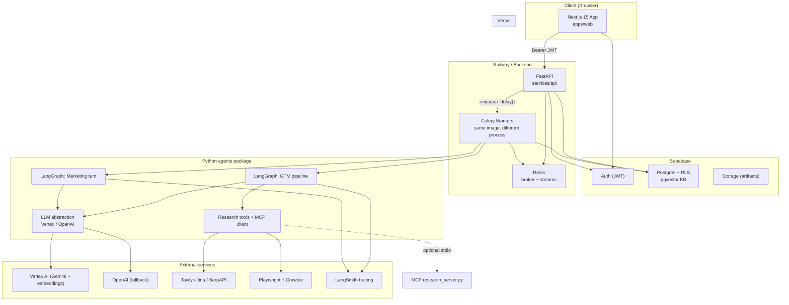
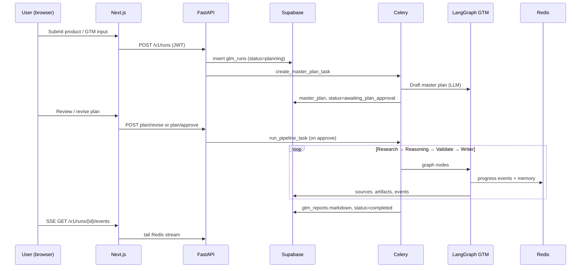
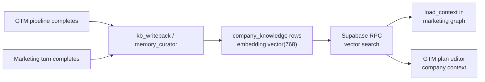

# Stoa — System Design & Architecture

This document describes how **Stoa** (the GTM & marketing workspace) is designed end-to-end: product intent, major components, data flows, and how each layer connects to the others.

For implementation checklists and env vars aimed at coding agents, see [`AGENT.md`](../AGENT.md). For local setup, see [`README.md`](../README.md).

---

## 1. Product overview

**Stoa** is a company-scoped workspace where founders and operators:

1. **Onboard companies** with profile, competitors, constraints, and brand context.
2. **Plan GTM** via editable plans, chat-driven refinements, and optional **autonomous GTM runs** that research the market and produce cited strategy reports.
3. **Execute marketing** via multi-agent chats that draft copy, scripts, channel plans, and creative direction—grounded in the same company knowledge base.

**Tagline:** Where GTM strategy and marketing share one shelter.

The system is intentionally split so the **browser never runs LangGraph** or holds privileged secrets. All agent work runs on the backend behind JWT-verified APIs.

---

## 2. High-level architecture



### Responsibility matrix

| Layer | Location | Responsibility |
|--------|----------|----------------|
| **Web UI** | `apps/web` | Marketing site, auth, dashboard, GTM/marketing workspaces, run timeline (SSE), report viewer |
| **API** | `services/api` | REST + SSE, JWT auth, Supabase persistence, Celery enqueue |
| **Workers** | `services/api` (Celery) | Long-running LangGraph invocations |
| **Agents** | `services/agents` | All LangGraph graphs, tool wiring, LLM calls, KB helpers |
| **MCP** | `services/mcp` | Optional stdio MCP server exposing research tools |
| **Postgres** | Supabase | Durable data, RLS, vector search for company KB |
| **Redis** | Railway / Docker locally | Celery broker, live event streams, run memory snapshots |

---

## 3. Monorepo layout

```
Agents/
├── apps/web/                 # Next.js (App Router), deployed to Vercel
├── services/
│   ├── api/                  # FastAPI app + Celery tasks + Supabase/Redis services
│   ├── agents/               # gtm_agents, marketing_agents, shared_memory
│   └── mcp/                  # FastMCP research server (stdio)
├── supabase/migrations/      # Schema, RLS, RPCs (e.g. vector search, atomic GTM upsert)
├── docs/                     # Human-facing design docs (this file)
├── AGENT.md                  # Agent/coder operational spec
├── docker-compose.yml        # Local Redis only
└── .github/workflows/ci.yml  # Web lint + API pytest
```

**Dependency rule:** `apps/web` → calls `services/api` only. `services/api` → imports `services/agents`. `services/agents` must not import FastAPI.

---

## 4. Two product flows (how work enters the system)

### 4.1 Flow A — Autonomous GTM run (research → report)

Used from **`/runs/new`** (optionally linked to a `company_id`).



**Human gate:** Execution does not start until the user **approves** the main agent’s master plan (`awaiting_plan_approval` → `queued` → `running`).

### 4.2 Flow B — Company workspace (GTM plan + marketing chat)

Used from **`/dashboard`**, **`/gtm`**, **`/marketing`** after onboarding.

| Surface | API prefix | Agent work |
|---------|------------|------------|
| Company CRUD, summary | `/v1/companies` | None (CRUD + plan editor LLM on message) |
| GTM plan chat | `/v1/companies/{id}/gtm/...` | `gtm_plan_editor` service (LLM edits plan JSON/markdown) |
| Marketing chats | `/v1/companies/{id}/chats`, `/v1/chats/{id}/messages` | Celery → `marketing.run_chat_turn` → marketing LangGraph |

Both flows share **`company_knowledge`** (pgvector) so GTM outputs and marketing turns reinforce the same company memory.

---

## 5. Frontend (`apps/web`)

### 5.1 Route groups

| Group | Routes | Purpose |
|-------|--------|---------|
| **Marketing** | `/`, `/how-it-works`, `/pricing`, `/faq` | Public site (Stoa brand from `src/lib/brand.ts`) |
| **Auth** | `/login`, `/auth/callback` | Supabase OAuth (Google); session cookies via `@supabase/ssr` |
| **App** | `/dashboard`, `/gtm`, `/marketing`, `/onboarding`, `/runs/*` | Authenticated workspace (middleware guards) |

### 5.2 How the web app talks to the backend

- **Auth:** Supabase session in the browser; access token passed as `Authorization: Bearer <jwt>` to FastAPI (`NEXT_PUBLIC_API_URL`).
- **No LangGraph in the browser:** All agent orchestration is server-side.
- **Active company:** `localStorage` key `stoa.activeCompanyId` (+ legacy migration from `nexara.*`) drives company switcher context across Dashboard / GTM / Marketing.
- **Live progress:**
  - GTM runs: `GET /v1/runs/{id}/events` (SSE) — see `runs/[id]/stream.ts`
  - Marketing chats: `GET /v1/chats/{id}/events` (SSE)

### 5.3 App shell

- **`AppHeader`**: Stoa logo, nav (Dashboard, GTM, Marketing), `CompanySwitcher`, sign-out.
- **Server components** load session + company list; client workspaces handle chat UI and streaming.

---

## 6. API layer (`services/api`)

### 6.1 Entry point

`app/main.py` mounts three routers:

| Router | Prefix | Domain |
|--------|--------|--------|
| `runs` | `/v1/runs` | Autonomous GTM runs, plans, reports, SSE |
| `companies` | `/v1/companies` | Companies, GTM plans/messages, marketing baseline |
| `marketing` | `/v1/...` | Chats, messages, artifacts, marketing SSE |

### 6.2 Authentication

`app/deps/auth.py`:

- Validates Supabase JWT (HS256 secret or JWKS for asymmetric keys).
- Injects `user_id` (`sub`) into route handlers.
- **Service role** Supabase client (`supabase_db`) is used server-side only — never exposed to the web app.

### 6.3 Service modules (glue to infrastructure)

| Module | Role |
|--------|------|
| `supabase_db.py` | All Postgres reads/writes (runs, companies, plans, chats, KB, RPCs) |
| `redis_events.py` | GTM run progress streams + SSE reader |
| `redis_marketing.py` | Marketing chat streams + turn locks |
| `redis_sync.py` | Sync publish helpers for Celery |
| `gtm_plan_editor.py` | LLM-assisted GTM plan edits from user messages |

### 6.4 Celery tasks

| Task name | Trigger | Invokes |
|-----------|---------|---------|
| `gtm.create_master_plan` | `POST /v1/runs` or plan revise | `create_master_plan_for_user` |
| `gtm.run_pipeline` | `POST /v1/runs/{id}/plan/approve` | `build_graph().invoke(...)` |
| `marketing.run_chat_turn` | `POST /v1/chats/{id}/messages` | `build_marketing_turn_graph().invoke(...)` |

Workers share the same Python environment as the API (`PYTHONPATH` includes `services/agents`).

---

## 7. GTM agent system (`services/agents/src/gtm_agents`)

### 7.1 LangGraph topology

Compiled in `graph.py` as a **linear pipeline** with approval/retry loops *inside* each node:

```
START → orchestrator → research → reasoning → validate → writer → END
```

| Node | Responsibility |
|------|----------------|
| **orchestrator** | Load user-approved `master_plan`; snapshot context to Redis |
| **research** | Autonomous research supervisor; MCP/tool calls; parent approval loop (up to 3 attempts) |
| **reasoning** | Segmentation, positioning, channels synthesis; approval loop |
| **validate** | Citation / source coverage checks |
| **writer** | Long-form Markdown report; approval loop; optional **KB writeback** to `company_knowledge` |

### 7.2 Autonomy model (`autonomy.py`)

Agents follow a consistent pattern:

1. **Plan** — LLM creates a step plan (`create_agent_plan`).
2. **Execute** — Sub-steps or tool calls run with progress callbacks.
3. **Approve** — Parent agent (`parent_approve`) gates progression.
4. **Revise** — On rejection, `generate_revision_instructions` and retry (bounded attempts).

The **research supervisor** (`autonomous_research`) is the most tool-heavy stage:

1. `list_research_tools()` — exposes tool names, descriptions, JSON schemas.
2. LLM selects a **subset** of tools and arguments (budget: max calls, max seconds).
3. `call_research_tools()` executes in-process implementations.
4. Results merge into `research_items` + `research_bundle`; persisted to `research_sources` via Celery callback.

### 7.3 Research tools & MCP

**In-process registry** (`mcp_client.py`):

| Tool | Purpose |
|------|---------|
| `web_research` | Tavily/Jina-style open-web search |
| `competitor_research` | SerpAPI competitor discovery |
| `crawl_web` | Playwright/Crawlee deep-read of known URLs |
| `crawl_search_results` | Search then crawl top hits |
| `full_research_suite` | Broad coverage when selective choice is insufficient |

**Optional MCP server** (`services/mcp/research_server.py`): FastMCP stdio server wrapping the **same** underlying functions — useful for external agent clients or consistent tool discovery semantics.

Environment flags:

- `GTM_DISABLE_LLM` — skip LLM planner; deterministic fallbacks.
- `GTM_DISABLE_EXTERNAL_RESEARCH` — block external calls; document blocked state.
- `GTM_RESEARCH_MAX_TOOL_CALLS`, `GTM_RESEARCH_MAX_SECONDS` — cost/latency guards.

### 7.4 LLM provider (`llm.py`)

Single module owns provider imports:

- **Primary:** `GTM_LLM_PROVIDER=vertex` (Gemini via Vertex AI).
- **Fallback:** OpenAI when `GTM_LLM_AUTO_FAILOVER=true` and primary throws (quota/auth/network).
- **Task tiers:** `cheap` | `standard` | `premium` map to different model IDs.
- **Contract:** `invoke_json(system, payload)` → parsed dict for all agent steps.

### 7.5 Memory & observability

| Mechanism | Storage | Purpose |
|-----------|---------|---------|
| `memory.py` | Redis `gtm:run:{id}:memory` | Cross-agent notes, plans, approvals during a run |
| `write_context_snapshot` | Redis | Working context hash |
| `observability.py` | LangSmith | Spans, run correlation stored in `agent_artifacts` |
| Progress callback | Redis Stream + `run_events` table | UI timeline |

---

## 8. Marketing agent system (`services/agents/src/marketing_agents`)

### 8.1 LangGraph topology

```
START → load_context → route → specialists → critic → finalize → curator → END
```

| Node | Responsibility |
|------|----------------|
| **load_context** | `kb_search` + `kb_facts` → formatted prompt context |
| **route** | LLM router picks specialist subset for this user message |
| **specialists** | Run zero or more subagents (see below) |
| **critic** | Quality gate on draft outputs |
| **finalize** | User-facing reply synthesis |
| **curator** | Persist learnings into company KB |

### 8.2 Specialist subagents (`subagents.py`)

| Agent | Output |
|-------|--------|
| `marketing_strategist` | Playbook summary, priorities, constraints |
| `competitor_intel` | Competitive angles from KB + ask |
| `idea_generator` | Campaign concepts |
| `copywriter` | Ad/social copy |
| `scriptwriter` | Video/audio scripts |
| `channel_planner` | Channel mix recommendations |
| `brand_voice_keeper` | Tone consistency vs brand notes |
| `image_generator` / `video_generator` | Vertex media (optional); artifacts in Supabase Storage |

All specialists share the same **`invoke_json`** LLM stack as GTM agents.

### 8.3 Concurrency

`try_acquire_marketing_turn_lock` in Redis prevents duplicate Celery processing of the same user message.

---

## 9. Shared company knowledge (`shared_memory/kb.py`)



- **Embeddings:** Vertex `text-embedding-004` (768 dimensions).
- **Kinds:** `competitor`, `positioning`, `icp`, `channel`, `learning`, `brand_decision`, `risk`, `other`.
- **Provenance:** `source_system` = `gtm` | `marketing`, optional `source_run_id` / `source_chat_id`.

This is what ties **Flow A** and **Flow B** together: marketing never starts from a blank slate if GTM work already happened for that company.

---

## 10. Data model (Supabase Postgres)

### 10.1 Core GTM tables (from `20250501000000_init_gtm.sql`)

| Table | Purpose |
|-------|---------|
| `gtm_runs` | Run lifecycle, `run_input`, `master_plan`, status, optional `company_id` |
| `agent_tasks` | Per-agent task records for a run |
| `research_sources` | Normalized citations (web, serp, crawl, …) |
| `agent_artifacts` | Plans, approvals, LangSmith correlation, bundles |
| `run_events` | Durable audit log of progress |
| `gtm_reports` | Final Markdown reports |

**Run statuses (conceptual):** `planning` → `awaiting_plan_approval` → `queued` → `running` → `completed` | `failed`.

### 10.2 Company workspace tables (`20260614000000_company_brain_and_marketing.sql`)

| Table | Purpose |
|-------|---------|
| `companies` | Tenant-scoped company profile |
| `company_knowledge` | Vector KB rows |
| `company_competitors` | Structured competitor records |
| `marketing_chats` / `marketing_messages` | Chat threads |
| `marketing_tasks` / `marketing_artifacts` | Task tracking + generated assets |
| `company_gtm_plans` / `gtm_plan_messages` | Editable plans + plan-scoped chat |

### 10.3 Row Level Security (RLS)

Every user-facing table enforces **`auth.uid() = user_id`** (directly or via join to `companies` / `gtm_runs`). The FastAPI service role bypasses RLS for worker writes, but policies remain for defense in depth and any future direct client access.

### 10.4 Notable RPCs / integrity (later migrations)

- Atomic GTM plan upsert / activation (`20260616000000_nexara_company_workflow.sql`).
- Triggers ensuring `plan_id` belongs to the same `company_id` as parent messages.
- `pgvector` HNSW index on `company_knowledge.embedding`.

---

## 11. Redis usage

| Key / stream pattern | Writer | Reader | Purpose |
|----------------------|--------|--------|---------|
| Celery broker | API / Worker | Worker | Task queue |
| `gtm:run:{id}:events` | Celery via `publish_event_sync` | SSE handler | Live GTM timeline |
| `gtm:run:{id}:memory` | Agents during run | Agents (siblings/parents) | Ephemeral agent memory |
| `gtm:run:{id}:ctx` | Orchestrator | Debugging / replay | Context snapshot |
| Marketing stream keys | `redis_marketing` | Marketing SSE | Chat progress |
| Turn locks | `redis_marketing` | Celery | Idempotent chat turns |

**Design choice:** Redis Streams (not Pub/Sub) so events survive if the UI connects late; critical events are **also** inserted into `run_events` in Postgres.

---

## 12. Real-time event contract

Payload shape (GTM and marketing share the same idea):

```json
{
  "run_id": "uuid",
  "chat_id": "uuid",
  "level": "info",
  "agent": "research_parent_agent",
  "phase": "research",
  "message": "Human-readable status",
  "detail": {}
}
```

SSE endpoints set `Cache-Control: no-cache`, `X-Accel-Buffering: no` for reverse proxies.

---

## 13. Security boundaries

| Secret / capability | Where it lives |
|-------------------|----------------|
| `SUPABASE_SERVICE_ROLE_KEY` | API/workers only |
| `OPENAI_API_KEY`, Vertex credentials | Workers only |
| Tavily, SerpAPI, Jina keys | Workers only |
| `LANGSMITH_API_KEY` | Workers only |
| `NEXT_PUBLIC_SUPABASE_URL`, anon key | Browser (RLS-protected) |
| `NEXT_PUBLIC_API_URL` | Browser |

The Next.js app **must not** embed service-role keys or provider API keys.

---

## 14. CI/CD & deployment topology

| Component | Typical host | Notes |
|-----------|--------------|-------|
| `apps/web` | Vercel | `pnpm lint:web` in GitHub Actions |
| `services/api` + Celery | Railway | Same container image; separate processes |
| Redis | Railway / `docker-compose` locally | Broker + streams |
| Postgres + Auth | Supabase Cloud | Migrations in `supabase/migrations/` |

CORS on FastAPI allows configured origins (e.g. Vercel preview + production URLs).

---

## 15. How components connect (integration checklist)

Use this table when tracing a feature across the stack:

| Concern | Web | API route | Celery task | Agent module | DB tables |
|---------|-----|-----------|-------------|--------------|-----------|
| New GTM run | `/runs/new` | `POST /v1/runs` | `create_master_plan` | `autonomy.create_master_plan_for_user` | `gtm_runs` |
| Approve plan | `/runs/[id]` | `POST .../plan/approve` | `run_pipeline` | `graph.build_graph` | `gtm_runs`, `gtm_reports`, `research_sources` |
| Live run UI | `/runs/[id]` | `GET .../events` | emits in tasks | `progress_callback` | `run_events` + Redis |
| Company onboarding | `/onboarding` | `POST /v1/companies` | — | — | `companies` |
| GTM plan chat | `/gtm` | companies GTM endpoints | — | `gtm_plan_editor` | `company_gtm_plans`, `gtm_plan_messages` |
| Marketing message | `/marketing/.../chats/[id]` | `POST .../messages` | `run_chat_turn` | `marketing_agents.graph` | `marketing_messages`, `marketing_artifacts` |
| KB retrieval | (context in UI) | — | — | `shared_memory.kb` | `company_knowledge` |
| KB writeback | — | — | end of GTM / marketing | `kb_writeback`, `memory_curator` | `company_knowledge` |

---

## 16. Extension points

| Extension | Hook |
|-----------|------|
| New research tool | Add to `gtm_agents/tools/`, register in `mcp_client._DIRECT_TOOLS`, optional mirror in `research_server.py` |
| New marketing specialist | Add `run_*` in `subagents.py`, extend router prompt, handle in `node_run_specialists` |
| New LLM provider | Extend `gtm_agents/llm.py` only |
| New company data type | Migration + `supabase_db` + optional KB `kind` |
| Checkpointer / resume | LangGraph checkpointer (Postgres/Redis) — planned in AGENT.md |

---

## 17. Related files (quick reference)

| Topic | Path |
|-------|------|
| GTM graph | `services/agents/src/gtm_agents/graph.py` |
| Research autonomy | `services/agents/src/gtm_agents/autonomy.py` |
| Tool registry | `services/agents/src/gtm_agents/mcp_client.py` |
| Marketing graph | `services/agents/src/marketing_agents/graph.py` |
| Celery GTM | `services/api/app/tasks/gtm.py` |
| Celery marketing | `services/api/app/tasks/marketing.py` |
| DB access | `services/api/app/services/supabase_db.py` |
| Brand copy (web) | `apps/web/src/lib/brand.ts` |
| Coder spec | `AGENT.md` |

---
*
