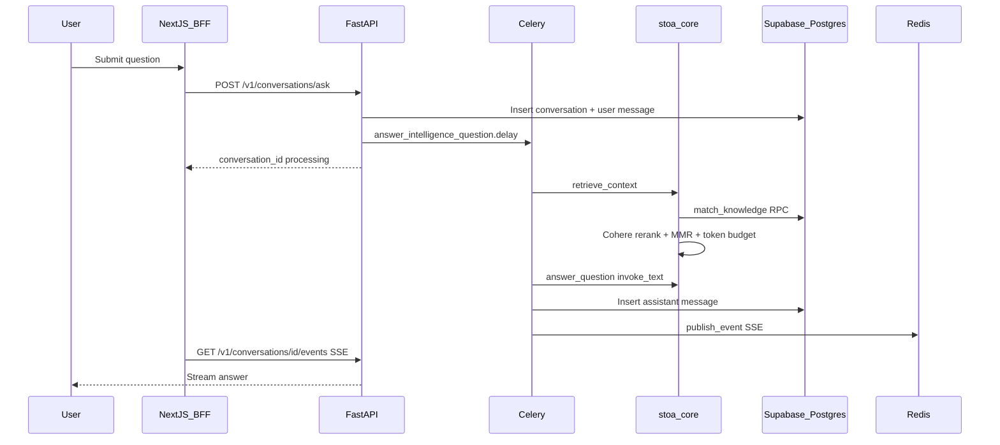
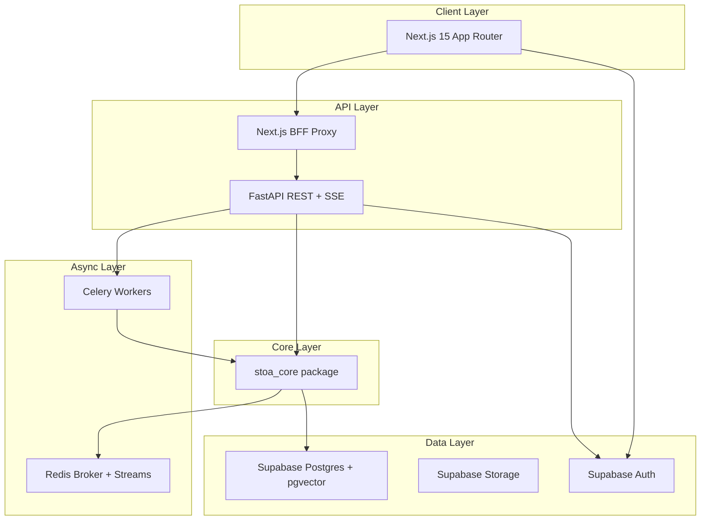

# Architecture

**One-liner:** Precomputed marketing intelligence platform with hybrid RAG and single-call synthesis.

## Why it exists

Marketing teams need cited answers from scattered customer data without paying for multi-agent research on every question. Stoa ingests once, precomputes ICP and insights in background jobs, and answers queries by retrieving stored evidence plus one LLM call.

## How it works

### Full stack flow

1. **Auth** — Supabase Auth (Google, email/password) → Next.js session → BFF proxy with JWT.
2. **Ingestion** — Uploads, pastes, and integration syncs → Celery → chunk + embed → `knowledge_chunks` (pgvector) + `intelligence` signals.
3. **Precompute** — Background tasks build ICP profiles, precomputed insights, executive summaries — stored in Postgres.
4. **Query** — User asks question → retrieve hybrid context → single `invoke_text` synthesis → cited answer.
5. **Realtime** — Celery publishes progress to Redis streams → SSE to frontend.

### User question → response displayed

## System layers

## Memory layers

| Layer | Store | Purpose |
|-------|-------|---------|
| Short-term | Redis streams + KB cache | SSE progress, query-embedding cache, retrieval cache |
| Long-term | Postgres | Orgs, documents, intelligence, ICP, campaigns, conversations |
| Semantic | pgvector `halfvec(3072)` | Unified `knowledge_chunks` |
| Structured | Postgres tables | `intelligence` signals, `icp_profiles`, `precomputed_insights` |

## Tech stack

| Technology | Role |
|------------|------|
| **Next.js 15** | App Router UI, BFF proxy, Supabase SSR auth |
| **FastAPI** | REST + SSE, JWT verification, job enqueue |
| **Celery + Redis** | Background ingestion, ICP, competitive, campaigns |
| **Supabase** | Postgres + pgvector + Auth + Storage + RLS |
| **stoa_core** | Shared config, LLM router, ingestion, RAG, integrations |
| **Vertex AI / OpenAI / Anthropic** | LLM with auto-failover |
| **Cohere** | Reranking (optional) |
| **Vercel** | Web deployment |
| **Render** | API + worker deployment |

## Key code callouts

- **`services/api/app/main.py`** — FastAPI entry, router registration.
- **`services/core/src/stoa_core/rag/retrieve.py`** — Hybrid retrieval pipeline.
- **`services/core/src/stoa_core/rag/answer.py`** — Single-call RAG synthesis.
- **`services/api/app/tasks/intelligence.py`** — Precompute + answer Celery tasks.

## Tech decisions

1. **Precompute, don't regenerate** — Expensive LLM chains run in background; query path is retrieve + synthesize once.
2. **Supabase-first** — One Postgres for structured + vector data; RLS for tenant isolation.
3. **Plain Python first** — No LangGraph in active stack; typed functions + Celery until Phase 3 campaign critic loops.

## Talking points

- Multi-org IAM: `X-Org-Id` header, four system roles + custom roles.
- Hybrid RRF retrieval in Postgres — no Pinecone dependency.
- BFF pattern keeps service role key off the browser.

## Related docs

- Dev ops reference: [`docs/architecture-ops.md`](architecture-ops.md)
- Agent build instructions: [`AGENTS.md`](../AGENTS.md)
