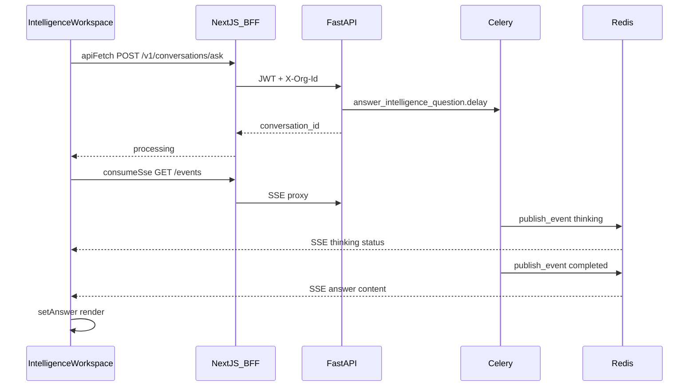

# Data Flow

**One-liner:** User action → client workspace → BFF proxy → FastAPI → Celery → SSE back to UI.

## Why it exists

Tracing a single user action end-to-end demonstrates how auth, org scope, async processing, and realtime updates connect across the stack.

## Example flow: User asks a question on Intelligence page

### Sequence

1. **User types question** in `IntelligenceWorkspace` input field (`question` state).
2. **User clicks Ask** → `handleAsk()` called.
3. **Set loading state** — `setLoading(true)`, `setStatus("Sending...")`.
4. **API call** — `apiFetch("/v1/conversations/ask", { method: "POST", body: JSON.stringify({ question }) })`.
5. **BFF proxy** — `app/api/backend/[...path]/route.ts`:
   - Reads Supabase session → `Authorization: Bearer <jwt>`
   - Reads `stoa-active-org` cookie → `X-Org-Id` header
   - Proxies to `NEXT_PUBLIC_API_URL/v1/conversations/ask`
6. **FastAPI** — `conversations.py` `ask_question()`:
   - `require_onboarded_scope()` → org + user
   - `require_permission(scope, "conversations:ask")`
   - `check_rate_limit(scope.user_id, 60, scope="ask")`
   - Redacts PII, sanitizes content
   - Inserts `conversations` + `messages` rows
   - `answer_intelligence_question.delay(conv_id, org_id, question)`
   - Returns `{ conversation_id, status: "processing" }`
7. **Client receives response** — `setConversationId(data.conversation_id)`.
8. **SSE subscription** — `consumeSse("/v1/conversations/{id}/events", onEvent)`:
   - BFF proxies SSE stream from FastAPI
   - Parses `data:` JSON lines
9. **Celery worker** — `answer_intelligence_question`:
   - `publish_event("conversation", id, { status: "thinking" })`
   - `retrieve_context(org_id, question)` → hybrid RAG
   - `answer_question(question, context)` → LLM synthesis
   - Inserts assistant `messages` row
   - `publish_event("conversation", id, { status: "completed", content: answer })`
10. **SSE events arrive** — `onEvent` handler:
    - `{ status: "thinking" }` → `setStatus("Retrieving intelligence...")`
    - `{ status: "completed", content: "..." }` → `setAnswer(content)`, `setLoading(false)`
11. **UI renders answer** in the workspace below the input.

### Error handling

- **API 401** — Middleware redirects to `/login`.
- **API 429** — Rate limit exceeded; error message shown.
- **SSE failure** — `catch` block sets error status; user can retry.
- **LLM failure** — Worker inserts no message; SSE may emit error status.

### Loading states

| Phase | UI state |
|-------|----------|
| Submitting | Button disabled, `loading=true` |
| Processing | Status text: "Retrieving intelligence..." |
| Complete | Answer rendered, loading cleared |
| Error | Error message, loading cleared |

## Architecture diagram

## Other key flows

### Upload document (Data Hub)

1. `DataHubContext.handleUpload(file)` → `apiFetch("/v1/ingestion/upload", FormData)`
2. API creates document + job, enqueues `ingestion.process_job`
3. Workspace polls `/v1/ingestion/jobs/{id}` or listens to SSE
4. On complete: refresh documents list from context

### Create campaign

1. `CampaignsWorkspace` → `apiFetch("/v1/campaigns", { brief, brand_voice })`
2. API inserts campaign row, enqueues `campaigns.generate`
3. SSE on `/v1/campaigns/{id}` or poll campaign status
4. On complete: display generated assets jsonb

### Switch organization

1. `OrgSwitcher` → `apiFetch("/v1/orgs/switch", { org_id })`
2. Sets `stoa-active-org` cookie
3. Page reload → all subsequent requests use new org scope

## Key code callouts

- **`apiFetch()`** — [`lib/api.ts`](../../apps/web/src/lib/api.ts) — Client fetch wrapper.
- **BFF proxy** — [`app/api/backend/[...path]/route.ts`](../../apps/web/src/app/api/backend/[...path]/route.ts).
- **`consumeSse()`** — [`lib/sse.ts`](../../apps/web/src/lib/sse.ts) — SSE parser.
- **`handleAsk()`** — [`intelligence-workspace.tsx`](../../apps/web/src/app/(app)/intelligence/intelligence-workspace.tsx) — Q&A orchestration.

## Tech decisions

1. **SSE over WebSocket** — Simpler proxy through BFF; Redis streams backend.
2. **No optimistic updates** — Answer waits for worker completion (processing state shown).
3. **BFF for all client API calls** — Single auth path; no direct FastAPI URL in browser.

## Talking points

- Upload flow triggers cascade: ingest → ICP rebuild → insight precompute (user sees updated dashboard later).
- Integration sync uses same SSE pattern on `/v1/integrations/sources/{id}/events`.
- Server-side rendering used for auth gates in `(app)/layout.tsx`; data fetching is client-side.
